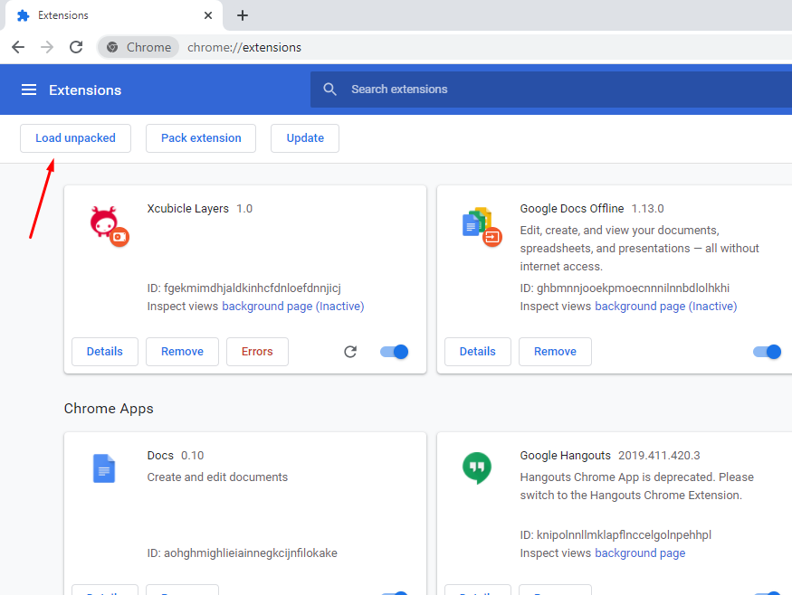
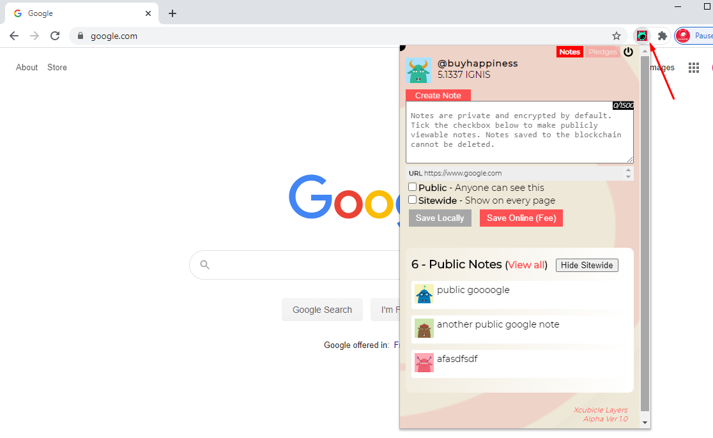

## Xcubicle Layers - Alpha Build

https://patoshii.github.io/xcubicle-layers

Layers is an app that lets users send crypto to URLs as a proxy payment address. The first target is crowdfunding donation sites like Gofundme and Q&A sites like StackOverflow. Our blockchain-based app adds new crypto payment options, which were not previously available. With this, we are able to cut out middlemen and provide new features not native to the site.

## Features

*Pledge Layer*
We've built a method of "pledging" cryptocurrency on any website directed to a user of the domain regardless if they accept it or not. This new payment layer sits on top of any webpage.

*Notes Layer*
Give users the ability to attach a sticky note to any website. These notes can be used privately for jotting down information when revisiting the same link. Or make them public for anyone to see. All notes are stored on a decentralized data cloud encrypted.

## Installation for Chrome Based Browsers

1. Download this extension as a zip and unzip it. https://github.com/patoshii/xcubicle-layers/archive/master.zip
2. In chrome goto the Extensions page: chrome://extensions then click on "Load Unpacked" and pick the folder with the extension.

## Usage

- Account registration is optional. You can choose Returning User and enter in any email and password to login, but pledging will be disabled.
- Currently pledging is only supported on Gofundme.com. Other sites like kickstarter.com, stackoverflow.com, linkedin.com, maps.google.com, and ebay.com have only demo code implemented. Eventually we will open pledging to any URL.
- Notes can be written on any URL. Everything is stored on the data cloud. Private notes are only seen by the account holder and public notes are seen by anyone visiting that page.

